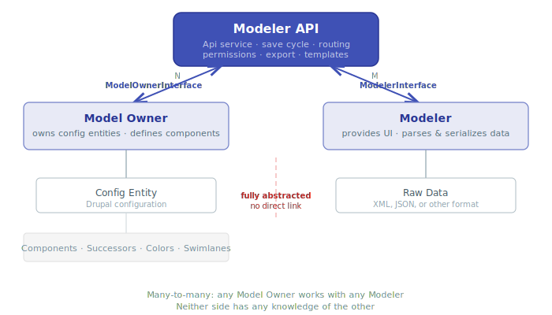

# Architecture Overview

The Modeler API follows a clear separation of concerns. It defines five plugin
types coordinated by a central API service, dynamic routing, and a permission
system -- all wired together through Drupal's service container.

## Plugin system overview

The module provides five plugin managers split into two discovery mechanisms:

### Attribute-based plugins (PHP classes)

| Plugin type | Service ID | Attribute | Interface | Namespace |
|-------------|-----------|-----------|-----------|-----------|
| Model Owner | `plugin.manager.modeler_api.model_owner` | `#[ModelOwner]` | `ModelOwnerInterface` | `Plugin\ModelerApiModelOwner` |
| Modeler | `plugin.manager.modeler_api.modeler` | `#[Modeler]` | `ModelerInterface` | `Plugin\ModelerApiModeler` |

### YAML-based plugins (configuration files)

| Plugin type | Service ID | YAML file pattern | Value object |
|-------------|-----------|-------------------|--------------|
| Context | `plugin.manager.modeler_api.context` | `MODULE.modeler_api.contexts.yml` | `Context` |
| Dependency | `plugin.manager.modeler_api.dependency` | `MODULE.modeler_api.dependencies.yml` | `Dependency` |
| Template Token | `plugin.manager.modeler_api.template_token` | `MODULE.modeler_api.template_tokens.yml` | `TemplateToken` |

## How Model Owner and Modeler interact

The relationship between Model Owner and Modeler is many-to-many: a single
Model Owner can work with multiple Modelers, and a single Modeler can serve
multiple Model Owners.



The Modeler API is the sole mediator between both sides. It provides separate
interfaces -- `ModelOwnerInterface` and `ModelerInterface` -- so that neither
side has any knowledge of the other. The Config Entity (owned by the Model
Owner) and Raw Data (owned by the Modeler) are completely isolated: there is
no direct link between them. All data flows through the Api service, which
translates between the two worlds using the generic `Component` value object.

### The save cycle

When a model is saved from the modeler UI, the following sequence executes:

1. The **Modeler** sends raw data (XML, JSON) to the save endpoint.
2. The **Api service** calls `Api::prepareModelFromData()`.
3. The **Modeler** parses the raw data via `ModelerInterface::parseData()`.
4. Metadata is extracted: ID, label, status, version, tags, changelog, etc.
5. The **Model Owner** resets existing components via
   `ModelOwnerInterface::resetComponents()`.
6. For each component read from the raw data
   (`ModelerInterface::readComponents()`), the Model Owner adds it via
   `ModelOwnerInterface::addComponent()`.
7. **Model constraints are validated** -- the Api service checks component
   counts and per-component successor counts against the cardinality rules
   declared by `ModelOwnerInterface::modelConstraints()`. Violations produce
   translatable error messages.
8. Components are validated using `Component::validate()`.
9. After all components are added and validated,
   `ModelOwnerInterface::finalizeAddingComponents()` is called.
10. The config entity is saved.
11. Raw model data is stored according to the configured storage method.

### Storage methods

Model data (the raw XML/JSON from the modeler) can be stored in three ways:

| Method | Constant | Description |
|--------|----------|-------------|
| **Third-party settings** | `Settings::STORAGE_OPTION_THIRD_PARTY` | Stored inside the config entity's third-party settings. Default. |
| **Separate entity** | `Settings::STORAGE_OPTION_SEPARATE` | Stored in a dedicated `modeler_api_data_model` config entity, linked by hash. |
| **None** | `Settings::STORAGE_OPTION_NONE` | No raw data is stored. The Model Owner reconstructs data from its own config. |

The storage method is configurable per Model Owner / Modeler combination in the
global settings form, and can be overridden per individual model.

## Component types

The API defines seven component types as constants on the `Api` class:

| Constant | Value | Name | Purpose |
|----------|-------|------|---------|
| `COMPONENT_TYPE_START` | `1` | `start` | Entry points / triggers / events |
| `COMPONENT_TYPE_SUBPROCESS` | `2` | `subprocess` | Sub-processes / nested models |
| `COMPONENT_TYPE_SWIMLANE` | `3` | `swimlane` | Visual grouping lanes |
| `COMPONENT_TYPE_ELEMENT` | `4` | `element` | Actions / tasks / activities |
| `COMPONENT_TYPE_LINK` | `5` | `link` | Conditions / sequence flows |
| `COMPONENT_TYPE_GATEWAY` | `6` | `gateway` | Decision / merge gateways |
| `COMPONENT_TYPE_ANNOTATION` | `7` | `annotation` | Text annotations |

Model Owners map these generic types to their domain-specific concepts. For
example, ECA maps `START` to events, `ELEMENT` to actions, and `LINK` to
conditions.

## Dynamic routing

The module generates routes dynamically per Model Owner via
`Routing\Routes::routes()`. For each registered Model Owner, the following
route groups are created:

- **Collection** -- list of all models for this owner
- **Add / Edit / Delete** -- CRUD forms
- **Enable / Disable / Clone / Export** -- model operations
- **Import** -- file import form
- **Settings** -- owner-specific settings (if the owner provides a settings form)
- **Modeler-specific routes** -- add/edit/view routes per Modeler plugin

Routes are protected by dynamic permissions generated per Model Owner and
Modeler. See [Routing & Permissions](../api-reference/routing-permissions.md)
for the full list.

## Template token system

The Modeler API includes a template token framework that allows template
models to define placeholder tokens which can be resolved at runtime and
applied to page elements via a Preact-based UI.

### TemplateTokenResolver

The `TemplateTokenResolver` service (`modeler_api.template_token_resolver`)
collects template token references found in arbitrary strings during a page
request. It:

1. Parses strings for `[prefix:token-path]` patterns.
2. Matches each token against the Model Owner's template token definitions.
3. Categorizes results by **purpose** (`select` or `config`).
4. Attaches resolved data to `drupalSettings` for the frontend.

```php
$resolver = \Drupal::service('modeler_api.template_token_resolver');
$resolver->addToken(
  '[template:eca-template:select:form:field:type:text]',
  'eca', 'my_model', 'Event_1abc'
);
$resolver->addConfig('plugin_id', 'my_action', 'eca', 'my_model', 'Event_1abc');
$resolver->addLabel('Send email', 'eca', 'my_model', 'Event_1abc');
```

### Token purposes

Each first-level child under a template token indicator must declare a
`purpose`:

| Purpose | Description |
|---------|-------------|
| `select` | Defines a CSS selector chain for DOM element selection. The frontend highlights matching elements and lets users pick one. |
| `config` | Provides a configuration value that is passed through without DOM interaction. |

Select-purpose tokens can include `selector` (CSS selector string) and
`target` (CSS selector for identifying target elements) keys at each level
of the tree.

### Templates controller

The `Controller\Templates` handles applying templates via `POST` to
`/system/modeler_api/apply_template`. The endpoint receives JSON with an
array of template application requests, each containing `model_owner_id`,
`model_id`, `component_id`, `target`, `hidden_config`, and `config`. It
delegates to `ModelOwnerInterface::applyTemplate()` for each item.

### Frontend library

The `template_token_selector` library provides a Preact-based UI component
(built from `ui/src/`) that renders the template token selection interface.
It reads resolved token data from `drupalSettings.modelerApiTemplateTokens`
and previously applied templates from
`drupalSettings.modelerApiAppliedTemplates`.

### Hook integration

The `Hook\TemplateHooks` class wires the template system into the page
lifecycle:

- **`hook_library_info_alter`** -- Injects `token_url` and
  `template_apply_url` into the library's `drupalSettings`.
- **`hook_page_attachments`** (ordered last) -- Calls
  `TemplateTokenResolver::getAttachments()` to attach the library and
  resolved data on every page that has tokens.

## Entity lifecycle hooks

The `Hook\EntityHooks` class implements three hooks:

- **`hook_entity_type_build`** -- For each Model Owner with a base path,
  overrides the entity type's access handler, list builder, delete form, and
  link templates so that the Modeler API manages the admin UI.
- **`hook_entity_operation`** -- Adds operation links (edit with modeler,
  view, enable/disable, clone, export, export as recipe) to entity listing
  pages.
- **`hook_modules_installed`** -- Clears entity type caches when a Model
  Owner's provider module is installed.

## Service architecture

```yaml
# Core services
modeler_api.service              # Api -- central coordinator
plugin.manager.modeler_api.model_owner  # ModelOwnerPluginManager
plugin.manager.modeler_api.modeler      # ModelerPluginManager
plugin.manager.modeler_api.context      # ContextPluginManager
plugin.manager.modeler_api.dependency   # DependencyPluginManager
plugin.manager.modeler_api.template_token # TemplateTokenPluginManager

# List builders (resolve and merge YAML plugins)
modeler_api.context_list_builder        # ContextListBuilder
modeler_api.dependency_list_builder     # DependencyListBuilder
modeler_api.template_token_list_builder # TemplateTokenListBuilder

# Template token system
modeler_api.template_token_resolver     # TemplateTokenResolver

# Utilities
modeler_api.export.recipe        # ExportRecipe
modeler_api.update               # Update
modeler_api.param_converter      # ModelerApiConverter
```

## Dependency injection pattern

Both `ModelOwnerBase` and `ModelerBase` declare their constructors and
`create()` methods as `final`. This is intentional: implementing plugins
**must not** use constructor-based dependency injection, as doing so would cause
circular dependencies in the service container.

`ModelOwnerBase` receives the following dependencies via its final constructor:

- `ConfigFactoryInterface` -- config factory
- `EntityTypeManagerInterface` -- entity type manager
- `UuidInterface` -- UUID generator
- `TimeInterface` -- datetime.time service

`ModelerBase` receives:

- `Request` -- current request
- `UuidInterface` -- UUID generator
- `ExtensionPathResolver` -- extension path resolver
- `FormBuilderInterface` -- form builder
- `LoggerChannelInterface` -- logger channel

Instead of constructor injection, implementing plugins should use **lazy getter
injection** via the container:

```php
protected function getMyService(): MyServiceInterface {
  if (!isset($this->myService)) {
    $this->myService = \Drupal::service('my_module.my_service');
  }
  return $this->myService;
}
```

`ModelerBase` provides a `getContainer()` helper that returns the DI container
for this purpose.
