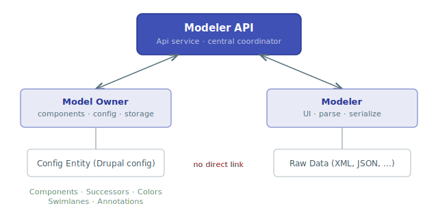

# Modeler API

The Modeler API module provides a framework for building visual modelers in
Drupal. It decouples the concept of *what is being modeled* (Model Owners) from
*how it is modeled* (Modelers), and supports rich contextual metadata through
three YAML-based plugin systems (Contexts, Dependencies, Template Tokens).

## Who is this for?

This documentation targets **Drupal module developers** who want to:

- Integrate their configuration entities with a visual modeler (implement a
  **Model Owner** plugin).
- Build a new visual editing experience (implement a **Modeler** plugin).
- Provide contextual component lists, dependency rules, or template tokens for
  an existing model owner (define **YAML plugins**).

## Key concepts

| Concept | Description |
|---------|-------------|
| **Model Owner** | A plugin that owns config entities which can be visually modeled. It defines available components, how they are stored, and how the model is saved. Examples: ECA, AI Agents. |
| **Modeler** | A plugin that provides the visual editing UI. It knows how to render, parse, and serialize model data. Examples: BPMN.iO (XML/BPMN), Workflow Modeler (JSON/React Flow). |
| **Context** | A YAML-based plugin that defines which components are available for a specific use case within a model owner. |
| **Dependency** | A YAML-based plugin that constrains which components can follow other components. |
| **Template Token** | A YAML-based plugin that provides token trees for use in model templates. |
| **Component** | A value object representing a single element in a model (event, action, condition, gateway, etc.). |

## Architecture at a glance

The **Modeler API** sits between Model Owners and Modelers as the sole
mediator. Neither side has any knowledge of the other -- the Config Entity
and Raw Data are completely isolated by the API's abstraction layer.

The **Api service** (`modeler_api.service`) acts as the central coordinator. It
exposes separate input/output interfaces for each side: `ModelOwnerInterface`
for Model Owners and `ModelerInterface` for Modelers. It manages the save
cycle (parse raw data, reset components, add components, finalize), and
exposes helpers for contexts, dependencies, export, and more.

## Module requirements

- **Drupal** `^11.2`
- **PHP** `>=8.3`
- Optional: `drupal/token` for template token support.

## Quick links

- [Architecture Overview](architecture/index.md) -- how all pieces fit together
- [Plugin Managers](plugin-managers/index.md) -- detailed reference for each plugin type
- [API Reference](api-reference/index.md) -- services, value objects, routing, schema
- [Implementation Guide](guide/index.md) -- step-by-step guides with code examples

## Community

- [Issue queue](https://drupal.org/project/issues/modeler_api)
- [GitLab repository](https://git.drupalcode.org/project/modeler_api)
- [Slack channel](https://drupal.slack.com/archives/C08K6KX2EHH)
